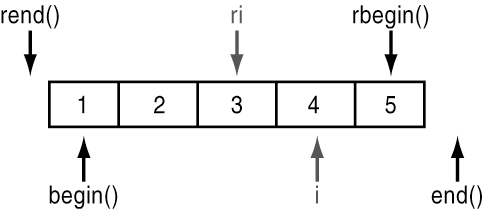

# STL (Стандартная библиотека шаблонов)

Предисловие: Большинство структур данных из библиотеки STL имеют сходный синтаксис, например
- все они создаются почти одинаково(как-то так: `struct<elements_type> name(size)`)
- чтобы получить количество элементов в структуре, нужно вызвать метод size: `struct.size()`
- и т.д.

Так что не пугайтесь, тут не так уж много нового:)

## Vector

Vector - динамический массив, т.е. такой массив, размер которого можно изменять, удалять элементы, вставлять элементы и т.д.
По факту **то же самое, только удобнее**. В ходе лекции мы часто будем говорить слово "массив", вместо "вектор", потому что они достаточно похожи.

<center></center>

Объявляется вектор так: `vector<тип_элементов> имя_вектора(размер_вектора, чем_заполнить)`

Таким образом:
Пример вектора: `vector<int> v(10,0)` - массив из 10 элементов, заполненный нулями
Аналогичный массив: `int v[10]`

Чаще всего удобнее создавать вектор из нулей, поэтому есть ещё одна форма создания вектора:
`vector<int> v(n)` - создаст вектор из n "пустых" элементов (*В этом случае вектор заполняется нулями*)

**Кстати, у вектора в качестве размера можно указать переменную(а не константу), в отличии от массива!**

Обращаться к элементу вектора нужно так же, как к массиву, т.е. v[i]
Нумерация также начинается начинается с 0, т.е. первый элемент доступен как v[0]
### Основные методы

#### На метод можно нажать чтобы почитать более подробно.

[`vector.size()`](https://en.cppreference.com/w/cpp/container/vector/size) - возвращает размер(количество элементов) массива.

[`vector.front()`](https://en.cppreference.com/w/cpp/container/vector/front) - возвращает первый элемент массива, аналог vector[0]

[`vector.back()`](https://en.cppreference.com/w/cpp/container/vector/back) - возвращает последний элемент массива. **достаточно удобно, чтобы не писать каждый раз v[v.size()-1]**

[`vector.push_back(element)`](https://en.cppreference.com/w/cpp/container/vector/push_back) - добавляет в конец массива element, увеличивает размер массива на 1.

[`vector.pop_back()`](https://en.cppreference.com/w/cpp/container/vector/pop_back) - удаляет последний элемент массива, уменьшает размер на 1, **не возвращает удаленное значение**.

[`vector.resize(new_size) или vector.resize(new_size, element)`](https://en.cppreference.com/w/cpp/container/vector/resize) - меняет размер массива на new_size, можно передать второй параметр element, тогда все новые элементы инициализируются этим значением.

### Методы, возвращающие указатели

<center></center>

Указатель на элемент - такая штука, которая знает, где элемент находится в памяти. Указатели нужны для других методов в основном (например для встроенной в STL сортировки вектора).

[`vector.begin()`](https://en.cppreference.com/w/cpp/container/vector/begin) - указатель на первый элемент массива.

[`vector.end()`](https://en.cppreference.com/w/cpp/container/vector/end) - указатель на фикитвный элемент за последним.

[`vector.rbegin()`](https://en.cppreference.com/w/cpp/container/vector/rbegin) - указатель на последний элемент массива.

[`vector.rend()`](https://en.cppreference.com/w/cpp/container/vector/rend) - указатель на фиктивный элемент перед первым.



## Pair

Pair - пара значений любых типов. Любых. Типов.

<center></center>
<center>(Это скомпилится)</center>

Чтобы обратиться к первому элементу пары надо писать `p.first`, ко второму - `p.second`. Пару можно инициализировать вот так `pair<int,string> p={2,"sigma"}`, или так `pair<int,string> p=make_pair(2,"sigma")`. Второй способ иногда не работает, рекомендуется пользоваться первым. <!--Вроде бы, я не уверен. --> Часто хочется нагромоздить кучу пар, если про у объекта более 2-х свойств(например точки в трехмерном пространстве). В таких случаях правильнее пользоваться собственноручно созданной структурой, или `tuple`-ом (про него подробнее написано ниже).

```c++
struct p{
    int x,y,z;
    p(){};
    p(int _x, int _y, int _z){
        x=_x;
        y=_y;
        z=_z;
    }
}

// или

// здесь должен быть пример с tuple-ом

```


___

## [Sigma Omsk](https://vk.com/sigma_omsk) 2020

