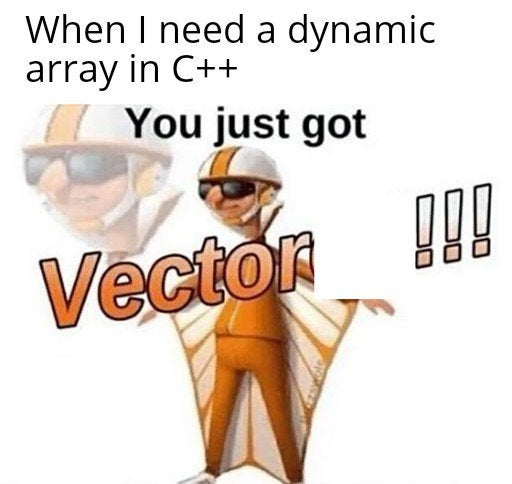

# STL (Стандартная библиотека шаблонов)

## Vector

Vector - динамический массив.

### Основные методы

#### На метод можно нажать чтобы почитать более подробно.

[`vector.front()`](https://en.cppreference.com/w/cpp/container/vector/front) - возвращает первый элемент массива.

[`vector.back()`](https://en.cppreference.com/w/cpp/container/vector/back) - возвращает последний элемент массива.

[`vector.begin()`](https://en.cppreference.com/w/cpp/container/vector/begin) - указатель на первый элемент массива.

[`vector.end()`](https://en.cppreference.com/w/cpp/container/vector/end) - указатель на фикитвный элемент за последним.

[`vector.rbegin()`](https://en.cppreference.com/w/cpp/container/vector/rbegin) - указатель на последний элемент массива.

[`vector.rend()`](https://en.cppreference.com/w/cpp/container/vector/rend) - указатель на первый элемент массива.

[`vector.push_back()`](https://en.cppreference.com/w/cpp/container/vector/push_back) - добавляет в конец массива то, что в скобочках, при необходимости увеличивает размер массива.

[`vector.pop_back()`](https://en.cppreference.com/w/cpp/container/vector/pop_back) - удаляет последний элемент массива, уменьшает размер на 1, **не возвращает удаленное значение**.

[``]
___

## [Sigma Omsk](https://vk.com/sigma_omsk) 2020

